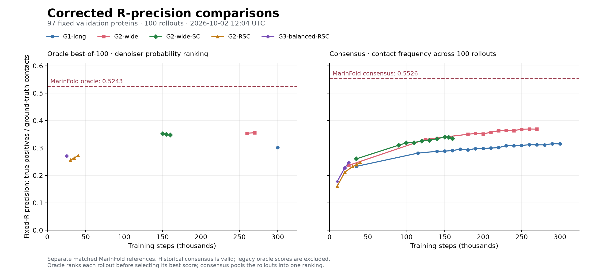

# Fixed-R diffusion evaluation

The earlier diffusion oracle scores divided by the number of emitted contacts
when a rollout supplied fewer than R. They were precision among emitted contacts,
not R-precision. In particular, the reported G2-RSC 30k value of 0.446965 is not
valid evidence of improved R-precision. Earlier consensus scores are unaffected.

The corrected scorer (`metric_version: fixed-r-v2`) uses the frozen 97-protein
validation split. For each protein and separation range, R is the number of
true contacts among resolved candidate pairs. Every readout divides true
positives by **R**. Zero-R cases are undefined and excluded from macro averages;
the counts of scored proteins are recorded.

- **Oracle best-of-100:** rank all eligible pairs by each rollout's final denoiser
  contact probabilities, evaluate top R, and take the best rollout per protein.
  Unselected pairs participate in the ranking. This uses probabilities already
  produced by diffusion; it requires no extra model passes.
- **Frequency consensus:** count each pair at most once per sampled map, rank all
  eligible pairs by occurrence count across 100 maps, and score top R. Zero-vote
  pairs remain candidates. This is compared with MarinFold frequency consensus.
- **Mean-probability ensemble:** average final probabilities across rollouts,
  rank all eligible pairs, and score top R. This is a separate diagnostic.
- **Sampled-map oracle:** rank only emitted contacts by their final probabilities
  and divide by R, giving missing ranks zero credit. This isolates the denominator
  correction from the change to dense probability ranking.

Ties use ascending residue-pair order, independent of labels. R and resolution
masks are evaluation inputs; prediction ranking does not inspect contact labels.
The full probability and frequency rankings can support a chosen contact budget
at inference, where ground-truth R is not known.

## Matched MarinFold reference

The pinned reference is exp321 `full_iid_single`: exp277 m2-p06 full-epoch 1.5B,
checkpoint 266344, T=1, top-p=0.95, 100 rollouts on exactly these 97 eval-val
proteins. Sequences, ground truth and resolved residues were checked against
Sparsa's frozen benchmark. Exp321's internally named dev/test cohorts partition
these validation proteins; no Sparsa eval-test or de novo results were used.

| Metric | All contacts (separation >= 6) | Long range (>= 24) |
|---|---:|---:|
| Frequency consensus R-precision | **0.552634** | **0.539416** |
| Validity-gated oracle best-of-100, fixed R | **0.524309** | **0.519901** |

The old 0.5199 all-range reference line was incorrect: that value is long-range
oracle accuracy. Consensus and oracle must use their respective baselines.
MarinFold ranks an individual rollout in emission order; Sparsa's dense oracle
uses model probabilities. The denominator and candidate universe match, but the
readouts differ. The sampled-map diagnostic makes that distinction explicit.

The baseline values are imported from published per-protein tables; local raw
MarinFold rollout files were unavailable. Source hashes and scoring policies are
in `marinfold-iid100-reference.json`; the paired rows are in
`marinfold-iid100-per-protein.csv`. Reproduce the import with:

```bash
uv run python scripts/import_diffusion_reference.py --marinfold-root /path/to/MarinFold
```

## Rollout of the correction

CPU regression tests and a real one-GPU evaluation smoke passed. Corrected
training evaluations use `validation-fixed-r-v2/step-N.*`, leaving old artifacts
intact. Summary files identify the scoring policy and rollout batch size; rollout
rows include R, selected count and true-positive counts for both dense and
sampled rankings. A summary is written only after the detailed rows succeed.

All four active jobs were replaced at batch priority and their durable evaluation
policies now identify `fixed-r-v2`. They resume at G2-wide 260k, SC 150k, G2-RSC
30k, and G3 25k, re-evaluating those checkpoints before continuing the original
300k-step training schedules. G1 completed training; a separate batch-priority
job re-evaluates its 300k checkpoint. At rollout of the correction, the full
evaluations were pending; the one-protein GPU smoke succeeded. Job identities, submission
commands and status snapshots are recorded here and in `reports/jobs`.

Historical consensus curves remain usable;
historical oracle curves require fresh sampling because saved summaries do not
contain the full probability rankings or enough sparse denominators to repair
all scores exactly.

## Current comparisons



### October 2, 12:05 UTC update (8:05 a.m. ET)

Four additional complete fixed-R evaluations have arrived. There are now ten
corrected oracle checkpoints and 49 valid consensus checkpoints in the plot.
All evaluations below use 97 validation proteins and 100 rollouts.

| Model | Latest evaluated step | Probability oracle @100 | Frequency consensus |
|---|---:|---:|---:|
| G1-long | 300k | 0.301375 | 0.314962 |
| G2-wide | 270k | **0.355547** | **0.368754** |
| G2-wide-SC | 160k | 0.347611 | 0.333730 |
| G2-RSC | 40k | 0.272258 | 0.246701 |
| G3-balanced-RSC | 25k | 0.271135 | 0.246599 |

G2-wide remains essentially flat: 260k to 270k changes oracle by +0.001666,
paired protein bootstrap 95% interval [-0.003424, 0.006764], and consensus by
-0.000418 [-0.005526, 0.004650]. SC is slightly lower at 160k than 155k,
with intervals spanning zero for both metrics. These checks do not demonstrate
a meaningful late-training improvement for either model.

G2-RSC improves from 30k to 40k: oracle +0.016646 [0.008052, 0.025201] and
consensus +0.014816 [0.006071, 0.023558]. It is learning under corrected scoring,
but remains well below the longer-trained wide model. Intervals use 100,000
paired protein resamples (seed 20261002); they condition on one training seed
and rollout bank. The 35k result is an additional resume evaluation; regular
evaluations remain every 10k steps.

All four Iris pods were running at the check. Latest logged steps were 270.4k /
163.3k / 40.3k / 25.1k for wide / SC / RSC / G3; saved steps were 270k / 160k /
40k / 25k. G3 has no new durable training milestone or evaluation since the
previous update. The [two new dedicated A100 runs](../diffusion_a100_v1/RUNNING.md)
have reached logged step 3,700 each without restarts; their first full validation
is pending step 10k. They do not yet appear as accuracy curves.

Evidence: `training-status-20261002-am.json`, `comparison-20261002-am.json`,
and four new summary/per-protein milestone pairs. Matched MarinFold references
remain 0.524309 oracle and 0.552634 consensus.

### October 2, 01:27 UTC update (October 1, 9:27 p.m. ET)

Six full corrected evaluations are now available, covering all five models.
The table uses the latest completed evaluation for each model; every row uses
97 validation proteins and 100 rollouts. All precision denominators are R.

| Model | Evaluated step | Probability oracle @100 | Frequency consensus | Mean-probability ensemble | Sampled-map oracle @100 |
|---|---:|---:|---:|---:|---:|
| G1-long | 300k | 0.301375 | 0.314962 | 0.318721 | 0.238739 |
| G2-wide | 260k | **0.353881** | **0.369172** | **0.372589** | **0.286951** |
| G2-wide-SC | 155k | 0.350630 | 0.339258 | 0.340880 | 0.269945 |
| G2-RSC | 30k | 0.255612 | 0.231885 | 0.237084 | 0.148972 |
| G3-balanced-RSC | 25k | 0.271135 | 0.246599 | 0.249960 | 0.156521 |

The corrected results do not support the previously reported RSC advantage.
For the same G2-RSC 30k checkpoint, legacy sparse precision was 0.446965;
correcting only the denominator gives sampled-map oracle 0.148972. Ranking all
pairs by model probabilities gives oracle 0.255612. These are different
readouts, and none of the legacy oracle points is included in the corrected
panel. The best corrected oracle gap to MarinFold is 0.170428; the best
frequency-consensus gap is 0.183462.

G2-wide and SC have similar oracle scores: wide at 260k minus SC at 155k is
+0.003251, paired 95% interval [-0.008033, 0.015332]. Wide's consensus advantage
is +0.029914 [0.017526, 0.043157]. SC changed little from 150k to 155k:
-0.000985 oracle [-0.009181, 0.006539]. The 155k evaluation was triggered by a
resume; the regular evaluation cadence remains 10k steps.

G3 at 25k exceeds G2-RSC at 30k by +0.015523 oracle [0.002725, 0.027398]. This
is not a matched-exposure architecture ablation. There is only one corrected
oracle checkpoint for each RSC model, so no corrected oracle learning trend
can yet be inferred. Intervals use 100,000 paired protein bootstrap resamples
(seed 20261002); they do not quantify training-seed or rollout-bank uncertainty.

Training is being interrupted frequently by batch-priority preemptions. Since
the corrected jobs were submitted, Iris reports 9 / 11 / 10 / 13 preemptions
for wide / SC / G2-RSC / G3, respectively, and zero job failures. At the status
check G2-RSC was training at 32.7k; wide was starting a replacement pod from
260k, while SC and G3 had pending replacement pods with 155k and 25k saved.
G1 training and its corrected 300k evaluation both completed successfully.
The active runs retain their original 300k-step targets and batch priority.

The G1 re-evaluation used rollout batch 2 rather than its original batch 4,
which changes random-number assignment even with the same base seed. Its
small consensus difference from the legacy record therefore is not solely a
scoring-code comparison. Other overlapping corrected records (wide 260k,
SC 150k, G2-RSC 30k) preserve their earlier consensus values.

Evidence: `training-status-20261002.json`, `job-status-20261002.json`,
`comparison-20261002.json`, and the six summary/per-protein milestone pairs.
The plot contains six corrected oracle points and 45 valid consensus points.

The oracle panel excludes every legacy score. The consensus panel retains the
valid historical measurements and uses the consensus reference, not the oracle
reference. Recover completed corrected evaluations and regenerate both panels:

```bash
uv run python scripts/fetch_fixed_r_evaluations.py --pod iris-bizon-sparsa-REPLACE-WITH-LIVE-POD
python scripts/plot_fixed_r_progress.py
```

The plotting environment needs matplotlib, pandas and numpy. Corrected results
are stored under `milestones/`; each recovered evaluation is checked against
the frozen protein identities and its per-protein metric means.
