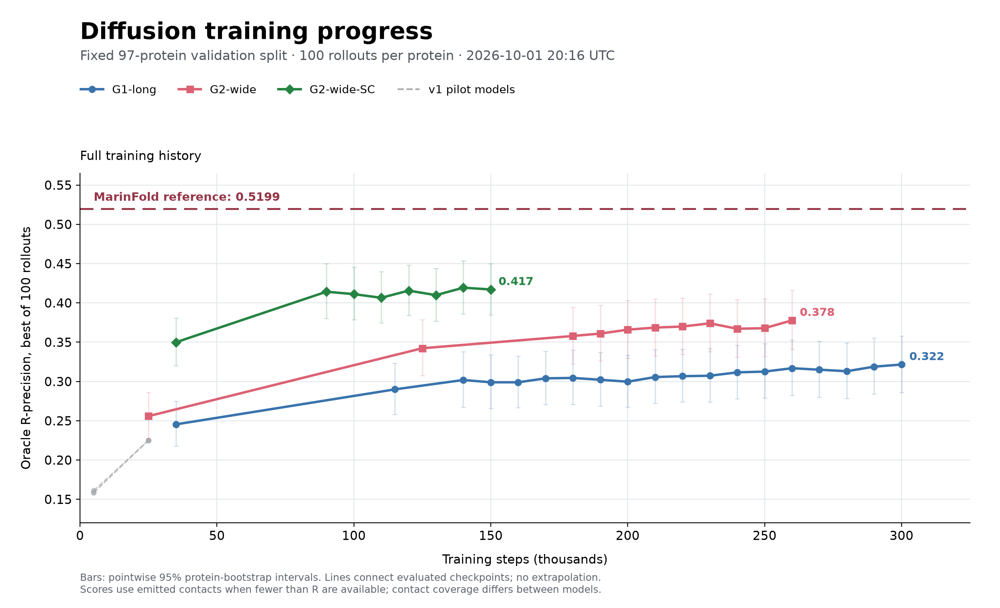

# Long-scale discrete-diffusion results

Architecture and checkpoint decisions use only the frozen 97-protein `eval-val`
split. Held-out sets have not been read.

The figure includes every discrete-diffusion checkpoint evaluated with rollout
seed 20260925. Error bars are pointwise 95% protein-bootstrap intervals. The
plotted values are available in
[`figures/r_precision_by_step.csv`](figures/r_precision_by_step.csv).

## First milestone

Each entry is one fixed 100-rollout bank with rollout seed 20260925. The original
25k control and self-conditioned checkpoints were pruned before evaluation, so
the available comparison uses step 35k for those arms and step 25k for the wide
arm.

| Arm | Step | Protein crops | Oracle R@100 | Long R@100 | Mean rollout R | Consensus R |
|---|---:|---:|---:|---:|---:|---:|
| G1-long | 35,000 | 4.48M | 0.245386 | 0.257664 | 0.139765 | 0.232834 |
| G2-wide | 25,000 | 3.20M | 0.255871 | 0.272289 | 0.145363 | 0.236419 |
| G2-wide-SC | 35,000 | 4.48M | **0.349880** | **0.385760** | **0.219382** | **0.260265** |

G2-wide-SC improves step-matched oracle R@100 over G1-long by 0.104494. The
paired protein-bootstrap 95% interval is [0.090685, 0.118386]. Its long-range
gain is 0.128095 [0.102293, 0.157255]. Both estimates use 100,000 resamples with
seed 20260928.

G2-wide at step 25k exceeds G1-long at step 35k by 0.010485 [0.002478,
0.018468]. This comparison favors G1-long in training exposure, but the
architectures are not checkpoint matched. G2-wide-SC exceeds G2-wide by
0.094009 [0.080304, 0.108062], with the same step mismatch in the opposite
interpretive direction: self-conditioning has more training here.

The stopping condition is not met for either candidate because neither trails
the control. The self-conditioned architecture is the clear early leader. Its
0.349880 remains 0.1700 below MarinFold's 0.5199 i.i.d. oracle R@100 reference.
All 100 sampled maps were unique for every protein in every arm, and the oracle
curves were still rising at rollout 100.

CoreWeave preemptions and three distributed-process aborts stopped G1-long and
G2-wide-SC at step 35k. They were resubmitted from their intact checkpoints with
larger retry budgets. At this point G2-wide had reached step 125k; its 100k
checkpoint had already been pruned, so 125k became the next milestone.

## G2-wide at step 125k

The 125k checkpoint represents 16.0 million crop presentations, five times the
25k exposure. It was evaluated with the same frozen 97-protein split and fixed
100-rollout seed bank.

| Step | Oracle R@100 | Long R@100 | Mean rollout R | Consensus R |
|---:|---:|---:|---:|---:|
| 25,000 | 0.255871 | 0.272289 | 0.145363 | 0.236419 |
| 125,000 | **0.342294** | **0.365924** | **0.227966** | **0.331418** |

The paired gain from 25k to 125k is 0.086423 oracle R@100, with 95% bootstrap
interval [0.069411, 0.104713]. Long-range oracle improves by 0.093635 [0.072246,
0.115739]. Longer training therefore remains strongly productive for the wide
architecture.

G2-wide at 125k is statistically indistinguishable in oracle R@100 from
G2-wide-SC at 35k: the difference is -0.007586 [-0.029697, 0.014701]. The
self-conditioned checkpoint retains more sampling headroom, while the longer
plain-wide run has a much stronger consensus score (0.331418 versus 0.260265).
A checkpoint-matched comparison remains necessary after G2-wide-SC catches up.

The 125k oracle curve still rises from 0.331542 at 64 rollouts to 0.342294 at
100, and all 100 maps remain unique per protein. The remaining gap to MarinFold's
0.5199 oracle reference is 0.1776.

## G2-wide at step 180k

The first automatic 10k-cadence evaluation ran at the resumed 180k checkpoint,
after 23.04 million crop presentations.

| Step | Oracle R@100 | Long R@100 | Mean rollout R | Consensus R |
|---:|---:|---:|---:|---:|
| 125,000 | 0.342294 | 0.365924 | 0.227966 | 0.331418 |
| 180,000 | **0.357893** | **0.377666** | **0.244460** | **0.349876** |

The paired oracle gain from 125k to 180k is 0.015598, with 95% bootstrap
interval [0.007795, 0.023260]. Mean-rollout R-precision improves by 0.016493
[0.010891, 0.022482], and consensus improves by 0.018458 [0.011072,
0.026412]. The long-range oracle gain is 0.011742, but its interval
[-0.007290, 0.028909] includes zero.

G2-wide at 180k is 0.008012 above G2-wide-SC at 35k in oracle R@100, though
the mismatched-step comparison remains statistically unresolved
[-0.014932, 0.031380]. The gap to MarinFold's 0.5199 oracle reference is now
0.1620. Evaluation will continue every 10,000 steps on the frozen validation
split.

## Near-matched control at step 115k

G1-long at step 115k has seen 14.72 million crop presentations, close to
G2-wide's 16.0 million at step 125k.

| Arm | Step | Protein crops | Oracle R@100 | Long R@100 | Mean rollout R | Consensus R |
|---|---:|---:|---:|---:|---:|---:|
| G1-long | 35,000 | 4.48M | 0.245386 | 0.257664 | 0.139765 | 0.232834 |
| G1-long | 115,000 | 14.72M | 0.289951 | 0.307577 | 0.180763 | 0.281096 |
| G2-wide | 125,000 | 16.00M | **0.342294** | **0.365924** | **0.227966** | **0.331418** |

Longer training improves G1-long from 35k to 115k by 0.044565 oracle R@100,
with paired 95% interval [0.033337, 0.056790]. At near-matched exposure,
G2-wide still exceeds G1-long by 0.052344 [0.040348, 0.065436]. Its long-range
advantage is 0.058347 [0.043396, 0.074316]. The wider sequence and pair state
therefore provides a material gain beyond training duration alone.

G2-wide-SC at only 35k also exceeds G1-long at 115k by 0.059929 [0.043342,
0.076525] oracle R@100. Its lower consensus score indicates that this early
self-conditioned model derives more of its advantage from diverse rollouts.
The decisive architecture comparison remains G2-wide versus G2-wide-SC at
matched steps.

## Automatic milestones at G1 140k and G2-wide-SC 90k

The 10k-cadence evaluator recorded the next available checkpoints before batch
preemptions. G1-long at 140k has seen 17.92 million crop presentations;
G2-wide-SC at 90k has seen 11.52 million.

| Arm | Step | Oracle R@100 | Long R@100 | Mean rollout R | Consensus R |
|---|---:|---:|---:|---:|---:|
| G1-long | 140,000 | 0.301896 | 0.317990 | 0.185582 | 0.287766 |
| G2-wide | 180,000 | 0.357893 | 0.377666 | 0.244460 | **0.349876** |
| G2-wide-SC | 90,000 | **0.414254** | **0.452324** | **0.272102** | 0.310071 |

Self-conditioning improves from step 35k to 90k by 0.064374 oracle R@100,
with a paired 95% interval [0.048535, 0.081164]. At less than half the training
exposure, it exceeds plain G2-wide at 180k by 0.056362 [0.034284, 0.080844].
Its long-range advantage is 0.074658 [0.044630, 0.107213]. This establishes
self-conditioning as the strongest tested architecture for the oracle metric.

The self-conditioned model still has lower consensus R-precision than plain
G2-wide at 180k by 0.039805 [0.027577, 0.052845], consistent with its larger
gain from sampling. Its oracle curve rises from 0.398696 at 64 rollouts to
0.414254 at 100, and all 100 maps remain unique per protein. The remaining gap
to MarinFold's 0.5199 oracle reference is 0.1056.

G1-long improves from 115k to 140k by 0.011945 oracle R@100 [0.004284,
0.020266]. Longer training is still productive for the control, but its rate
of improvement and absolute result remain well behind G2-wide-SC.

## Later automatic milestones

The evaluator subsequently captured every 10k checkpoint through G1-long
190k, G2-wide 200k, and G2-wide-SC 110k.

| Arm | Step | Oracle R@100 | Long R@100 | Mean rollout R | Consensus R |
|---|---:|---:|---:|---:|---:|
| G1-long | 140,000 | 0.301896 | 0.317990 | 0.185582 | 0.287766 |
| G1-long | 150,000 | 0.298972 | 0.313022 | 0.186550 | 0.288580 |
| G1-long | 160,000 | 0.298949 | 0.312530 | 0.189095 | 0.290276 |
| G1-long | 170,000 | 0.303971 | 0.321663 | 0.191030 | 0.295518 |
| G1-long | 180,000 | **0.304509** | 0.314697 | 0.191657 | 0.293065 |
| G1-long | 190,000 | 0.302147 | 0.319878 | **0.193372** | **0.297529** |
| G2-wide | 180,000 | 0.357893 | 0.377666 | 0.244460 | 0.349876 |
| G2-wide | 190,000 | 0.360972 | 0.371930 | 0.246097 | **0.353009** |
| G2-wide | 200,000 | **0.365925** | **0.389395** | **0.248431** | 0.351518 |
| G2-wide-SC | 90,000 | **0.414254** | 0.452324 | 0.272102 | 0.310071 |
| G2-wide-SC | 100,000 | 0.411184 | **0.459157** | 0.276758 | 0.318414 |
| G2-wide-SC | 110,000 | 0.406518 | 0.447963 | **0.280163** | **0.319433** |

G1-long has plateaued in the oracle metric: its 190k-minus-140k difference is
0.000252 with paired 95% interval [-0.008653, 0.009036]. Mean-rollout and
consensus scores continue to improve slightly.

Plain G2-wide is still making a small oracle gain. Step 200k exceeds step 180k
by 0.008033 [0.000879, 0.015509], and its long-range oracle gain is 0.011729
[0.001750, 0.022927].

G2-wide-SC's oracle score has plateaued after step 90k. The step-100k change is
-0.003070 [-0.017923, 0.009347], and the step-110k change is -0.007736
[-0.023132, 0.005448], both relative to 90k. These are unresolved differences,
while its mean-rollout and consensus scores continue to increase. Step 90k
therefore remains the validation-selected checkpoint for oracle R@100.

Even the latest G2-wide-SC checkpoint at 110k exceeds plain G2-wide at 200k by
0.040593 oracle R@100 [0.023996, 0.057869], despite 14.08 million versus 25.60
million crop presentations. The best observed gap to MarinFold remains 0.1056
at the self-conditioned 90k checkpoint.

## October 1 continuation

Fifteen new automatic evaluations extend G1-long through 260k, G2-wide through
250k, and G2-wide-SC through 140k. The figure and CSV above include every one.

| Arm | Latest evaluated step | Latest oracle R@100 | Best observed oracle R@100 |
|---|---:|---:|---:|
| G1-long | 260k | 0.316874 | 0.316874 at 260k |
| G2-wide | 250k | 0.367824 | 0.374024 at 230k |
| G2-wide-SC | 140k | 0.419380 | 0.419380 at 140k |

SC's new maximum is only 0.005126 above 90k, with paired 95% interval
[-0.011687, 0.020361]. Its plateau remains unresolved. Plain wide is essentially
unchanged from 200k to 250k: +0.001899 [-0.006508, 0.010106]. G1 has improved
from 190k to 260k by 0.014727 [0.007672, 0.021821]. G1 and plain wide are now
in the planned learning-rate decay phase beginning at 240k.

The [v3 report](../diffusion_v3/RESULTS.md) includes the combined plot with the
new RSC runs and comparisons. Their first results are promising, but contact
coverage differs and there are too few new-model checkpoints to establish a
sustained scaling trend.

## October 1, 20:16 UTC continuation

G1 completed 300k steps successfully, with final oracle R@100 of 0.321551.
The new 270k, 280k, and 290k scores are 0.314974, 0.313057, and 0.318850.
Plain G2-wide reaches a new best of 0.377787 at 260k. G2-wide-SC is 0.417097
at 150k, leaving its best observed score at 0.419380 (140k); it remains near
the plateau. These six new checkpoints are included in the updated figure.

The [v3 report](../diffusion_v3/RESULTS.md) includes two new G2-RSC evaluations:
0.377204 at 20k and 0.446965 at 30k. The latter is the new best observed oracle
score, with substantially lower contact coverage than original SC. The paired
advantage over SC's best checkpoint remains statistically unresolved.
