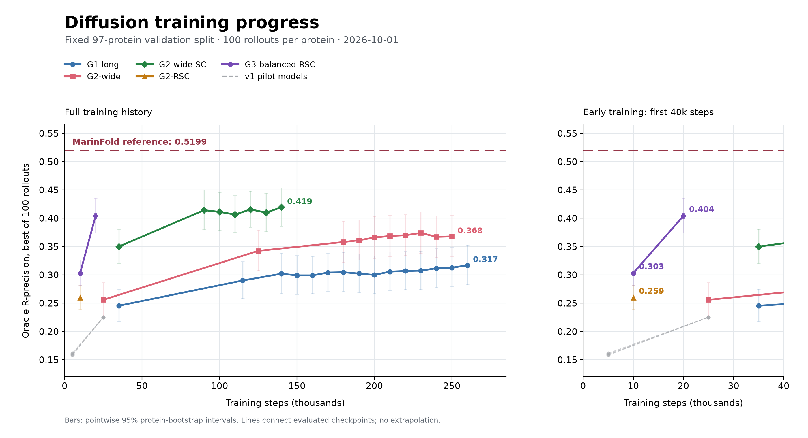
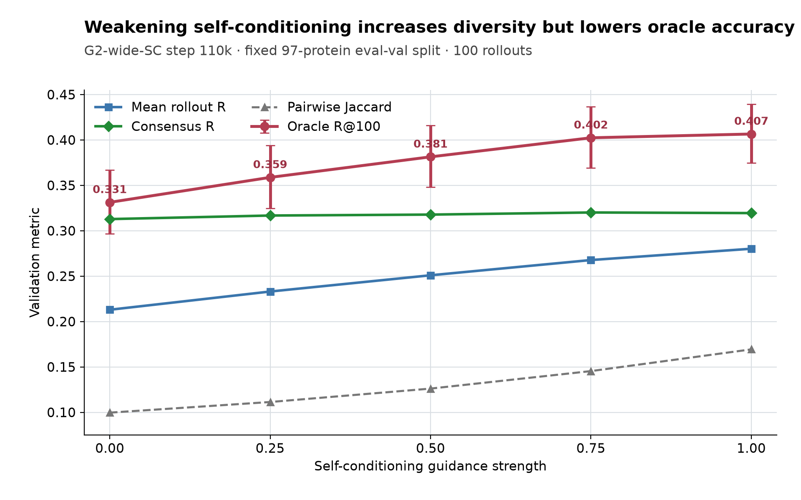

# Rollout-consistent diffusion results

Architecture and checkpoint decisions use only the frozen 97-protein `eval-val`
split. Held-out sets remain untouched.

## Training update: October 1

All five long runs are active on eight H100s each at batch priority. The latest
training logs at 13:22 UTC reported G1-long 268.5k, G2-wide 253.7k, G2-wide-SC
145.0k, G2-RSC 19.1k, and G3-balanced-RSC 20.6k. Each run targets 300k steps;
validation runs every 10k on the same 97 proteins with 100 rollouts.

| Model | Parameters | Latest evaluation | Oracle R@100 | Long oracle R@100 | Mean rollout R | Mean contacts |
|---|---:|---:|---:|---:|---:|---:|
| G1-long | 10.9M | 260k | 0.316874 | 0.335252 | 0.206284 | 196.8 |
| G2-wide | 26.5M | 250k | 0.367824 | 0.389955 | 0.259384 | 178.3 |
| G2-wide-SC | 26.5M | 140k | **0.419380** | **0.435961** | **0.292723** | 142.0 |
| G2-RSC | 26.5M | 10k | 0.259456 | 0.321948 | 0.172529 | 139.5 |
| G3-balanced-RSC | 92.0M | 20k | 0.404127 | 0.425623 | 0.278566 | 85.0 |

G3 improves from 0.303081 at 10k to 0.404127 at 20k. The paired improvement is
0.101046 [0.081362, 0.121211]. At matched 10k exposure, G3 exceeds G2-RSC by
0.043625 [0.032975, 0.054565]. This supports continuing the larger model, but
two checkpoints do not establish that it can sustain improvement over a long
run. G3 also changes the learning rate and rollout batch size, so this is not
a pure parameter-count ablation.

G3 at 20k exceeds original G2-wide-SC at 35k by 0.054247 [0.036123, 0.072699],
despite fewer crop presentations. Relative to SC's new best at 140k, the
difference is -0.015253 [-0.041302, 0.010232]. The latest SC value improves on
its 90k value by only 0.005126 [-0.011687, 0.020361]; a sustained improvement
over the plateau is not yet established. The best gap to MarinFold's 0.5199
reference is 0.100520 (0.115773 for G3 at 20k).

G3 produces substantially fewer contacts: about 85 per rollout versus 142 for
SC at 140k. The inherited oracle scorer uses the available selected contacts
when fewer than R are emitted, so this is not a comparison at equal contact
coverage. Higher precision alone does not establish a better contact set for
Helico. Consensus R is also lower for G3 (0.227517 versus 0.333651). Coverage
and a fixed-contact-budget diagnostic should accompany later promotion decisions.

G1 has improved modestly from 190k to 260k: +0.014727 [0.007672, 0.021821].
Plain G2-wide peaked at 0.374024 at 230k; its latest 250k score differs from
200k by only +0.001899 [-0.006508, 0.010106]. G1 and plain G2-wide have entered
the scheduled learning-rate decay beginning at 240k.

Intervals use 100,000 paired protein bootstrap resamples, seed 20261001, on
one rollout seed bank and one training seed. They do not include training-seed
or rollout-bank uncertainty. All 18 new milestones and comparisons are saved
in the v2/v3 milestone directories. The plot contains 41 evaluated checkpoints,
including the early pilot models. Rebuild it with
`python scripts/plot_diffusion_progress.py --as-of 2026-10-01` in an environment
with matplotlib, pandas, and numpy.

## Existing-model self-conditioning guidance

The G2-wide-SC 110k checkpoint was sampled with weaker self-conditioning to test
whether restoring rollout diversity could recover the stalled oracle metric.
All evaluations use the same 100-rollout seed bank.

| Guidance | Oracle R@100 | Mean rollout R | Consensus R | Pairwise Jaccard |
|---:|---:|---:|---:|---:|
| 0.00 | 0.331278 | 0.212956 | 0.312819 | 0.099624 |
| 0.25 | 0.358760 | 0.233030 | 0.316737 | 0.111344 |
| 0.50 | 0.381376 | 0.250926 | 0.317766 | 0.126114 |
| 0.75 | 0.402364 | 0.267704 | **0.320094** | 0.145394 |
| 1.00 | **0.406518** | **0.280163** | 0.319433 | 0.169320 |

Reducing guidance produces more diverse maps, but the loss of conditional
accuracy is larger than the oracle benefit from that diversity. Guidance 0.5
trails full conditioning by 0.025143 oracle R@100, with paired 95% interval
[-0.037394, -0.013462]. Guidance 0.75 is statistically indistinguishable from
full conditioning at -0.004154 [-0.013745, 0.005111], while its mean rollout
score is lower by 0.012459 [-0.016345, -0.009117]. Full guidance remains the
primary setting.

At this checkpoint, the tested reductions in self-conditioning strength did not
improve oracle accuracy. This does not establish the cause of the plateau or
rule out other sampling changes. The G2-RSC and G3-balanced-RSC runs change
training to expose the model to its own one-step reverse states. The 26.5M
control tests that training change; the 92.0M model tests increased sequence
and global-pair capacity under the new training scheme.
