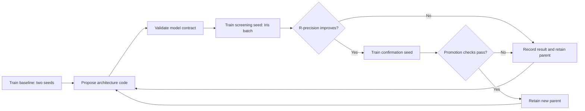

# Sparsa autoresearch

An autonomous architecture search over the existing sequence-only contact model.
The controller establishes a matched baseline, asks Codex for a new model
implementation, trains it on Iris, measures validation R-precision, confirms
promising changes with another seed, and retains the better architecture as the
parent of subsequent proposals. It stops when its budget or candidate limit is
reached. It does not modify the model in your working repository.

The approach borrows the editable-model/fixed-evaluator loop from
[autoresearch](https://github.com/karpathy/autoresearch). Sparsa uses equal
training exposure rather than autoresearch's fixed short wall-clock budget.
The code proposer uses the installed [Codex non-interactive CLI](https://learn.chatgpt.com/docs/non-interactive-mode)
with read-only execution and structured JSON output. It reuses local CLI
authentication; credentials are not copied to experiment snapshots or GPUs.



## Start, inspect, and stop

The first campaign, `outputs/autoresearch-v1`, completed eight trials using
13.1386 H100-hours of running time and its 32 H100-hour reservation budget.
No candidate met the promotion rule; see [results](../reports/AUTORESEARCH.md).
Use a new directory for a new campaign; do not initialize this one again.
Its recorded launch is in
[`reports/autoresearch_campaign.json`](../reports/autoresearch_campaign.json).

From the Sparsa repository, with dependencies installed using `uv sync`:

```bash
# Initialization freezes the source and protocol; it submits no jobs.
# Use a fresh name/directory when starting another campaign.
.venv/bin/python -m research.controller init \
  --name arch-v1 --campaign outputs/autoresearch-v1 --gpu-hours 32

# Run continuously. The process reconnects to existing jobs after a restart.
.venv/bin/python -u -m research.controller run \
  --campaign outputs/autoresearch-v1 --watch

# In another terminal:
.venv/bin/python -m research.controller status --campaign outputs/autoresearch-v1
.venv/bin/python -m research.controller stop --campaign outputs/autoresearch-v1
```

For a background process, redirect stdout/stderr to a log and use your process
supervisor or `nohup`. `run` automatically executes the frozen controller in the
campaign's `base` directory. A file lock permits only one controller per campaign.
Unique run suffixes prevent independently initialized campaigns from sharing job
names. The existing production training/finetuning coordinator is independent.

`stop` lets the active GPU trial finish and prevents the next trial. To resume,
optionally increasing the **total** campaign allocation:

```bash
.venv/bin/python -m research.controller resume \
  --campaign outputs/autoresearch-v1 --gpu-hours 64
.venv/bin/python -u -m research.controller run \
  --campaign outputs/autoresearch-v1 --watch
```

Run without `--watch` to perform one controller transition, useful for debugging.
A stopped controller does not cancel a submitted job. Its frozen worker and Iris
timeout still bound that trial; restart the controller to collect results.
`baseline_failed`, `proposer_failed`, or `needs_inspection` require inspection
of `events.jsonl`, proposal logs, and/or failure logs before resuming. Failed
baselines are never silently replaced with an easier baseline. A new campaign
is the clean way to change the protocol or fix frozen worker code.

## What is compared

The initial protocol is [protocol.yaml](protocol.yaml):

| Setting | Default |
|---|---|
| Objective | Macro R-precision over all valid pairs |
| Secondary metric | Long-range macro R-precision |
| Evaluation | Exact MarinFold `eval-val`, 97 proteins |
| Teacher corpus | Existing decontaminated AFDB/ESMFold2, 50/50 by protein |
| Initialization | Fresh random weights for every trial |
| Training | 3,000 steps, crop 256, global batch 32 |
| Seeds | 17 for screening, 37 for confirmation |
| GPU allocation | One trial at a time, four H100s, **batch** priority |
| Checkpoints | Every 250 steps; automatic resume after preemption |
| Model/readout | Final-step EMA, original distance readout |
| Parameter limit | 100 million |
| Search allocation | 32 H100-hours reserved, at most 12 candidate ideas |

The first two trials train the unmodified 40M baseline. Candidates change only
`sparsa/model.py` and its model configuration. All trainer, loss, data, scoring,
dependency, and benchmark files are hashed and verified before submission and
inside the worker. The teacher shard-list hash must match across trials. The
controller owns seeds and all training hyperparameters. Neither inherited weights
nor best-of-many-checkpoint selection can give a candidate extra exposure.

All trials use the same fixed step count and number of crops. Architectures may
cost different amounts of compute; actual running GPU time and parameter counts
are recorded. This measures performance at matched data exposure, not matched
FLOPs. The default run is a screening budget, **not** a comparison against the
100,000-step production model or proof of better eventual scaling.

Screening requires an absolute R-precision gain of at least 0.002. Promotion
then requires positive gains on both matched seeds, mean gain >= 0.002, a positive
lower bound from a paired protein bootstrap, and mean long-range regression no
worse than 0.002. Bootstrap samples average the two seeds per protein before
resampling proteins. Because the validation set is reused adaptively, the
interval is descriptive search evidence, not a confirmatory significance test.

The loop never evaluates test or de novo proteins. A promising architecture
should next be compared at a larger, matched training budget before a separate
final held-out evaluation. Create another campaign with a longer protocol and
the desired baseline source to study scaling. Do not select future proposals
using held-out scores from the original production campaign.

## Budget and recovery behavior

Each trial reserves its full timeout allocation: four H100s × one hour = four
H100-hours. Reservations are not refunded for fast completion or failure, so the
default campaign admits at most eight GPU trials, including the baseline seeds.
Parameter-invalid proposals use no GPU reservation. Codex proposal calls have
their own 15-minute timeout and the candidate-count limit; CLI/model usage is
separate from the GPU allocation.

Iris jobs are root jobs explicitly submitted at **batch** priority with no
automatic retry for ordinary failures. Batch preemptions resume the same trial
from its saved optimizer/RNG/data cursors. A persistent worker deadline includes
queue gaps after preemption, conservatively preventing a fresh full allowance
on each restart. The controller also checks cumulative attempt GPU time and
cancels an over-budget trial. Cancellation is not instantaneous; allocation,
startup, polling, and scheduler delays can make actual resource time exceed a
reservation. Overages count against subsequent admissions. This is a resource
control, not an exact billing cap.

A CPU-only batch bridge retrieves S3 result JSON without moving credentials to
the workstation. It renews if its own job ends, and is cancelled when the search
stops. The controller records job IDs **before** submission and reconciles the
same ID after an uncertain response. Infrastructure/timeout failures are logged
as failed trials, not fabricated low-accuracy scores. Invalid or incomplete
result coverage halts the campaign for inspection.

## Guide the ideas

Edit the campaign's `IDEAS.md` to steer subsequent proposals without changing the
experiment protocol. Each prompt, response, invocation, and Codex event log is
retained. The editable research instructions live in [program.md](program.md)
and are frozen at campaign initialization.

The default proposer writes new architecture code. `--proposer seeded` runs
three reproducible starting ideas without an LLM: more sequence depth, more pair
depth, and absolute-difference sequence features in pair initialization.
`--proposer hybrid` runs those first, then code proposals if budget remains.
Use `--codex-model` to pin a particular available CLI model; otherwise the CLI
uses its configured default. An unavailable proposer pauses the campaign.

Models must preserve sequence tokenization, symmetry, padding isolation,
gradient flow, checkpoint reload, and full-length inference. CPU contract tests
precede GPU submission; a 920-residue GPU forward check precedes training.
The source validator rejects ordinary I/O and non-tensor imports. It is an
accidental-misuse check, **not a security sandbox for hostile Python**. Keep the
proposer constrained to model code and review exported changes before adoption.

## Artifacts and adopting a winner

The campaign directory contains:

- `REPORT.md`: readable leaderboard and campaign state.
- `state.json`, `events.jsonl`: resumable ledger, reservations, observed attempt
  accounting, decisions, and errors.
- `base/`, `contract.json`, `protocol.json`: frozen source and comparison rules.
- `candidates/`: model source, hypotheses, configurations, and proposal transcripts.
- `submissions/`: exact Iris commands, including explicit batch priority.
- `work/`: exact submitted source/config/spec for each seed.
- `results/`: validated metrics and per-protein R-precisions.
- `failures/`: available task logs for failed trials.

Remote run URIs in the ledger retain full resumable checkpoints, teacher/source
provenance, model code, per-protein metrics, and inference timings. To export the
confirmed champion's runnable source and checkpoint references:

```bash
.venv/bin/python -m research.controller export \
  --campaign outputs/autoresearch-v1 --out outputs/autoresearch-winner
```

Load a candidate checkpoint using its accompanying source snapshot, since its
architecture can differ from the main repository. The exported source retains
the existing Sparsa predict/evaluate CLI and Helico contact format. Export does
not overwrite the production model, evaluate held-out sets, download weights,
or claim a model-quality improvement beyond the measured search protocol.

## Verification

The local suite has 31 passing tests, including ten search tests covering complete
promotion, matched seeds, coverage/protocol integrity, budget limits, source
tampering, a lost submission response, stop behavior, and failed baselines.
A real three-trial batch-H100 smoke campaign completed and cancelled its CPU
bridge automatically, using 0.04881 H100-hours of measured running resource time.
Those two-step tiny-model results are operational checks only. See
[`reports/autoresearch_smoke.json`](../reports/autoresearch_smoke.json).

A real Codex invocation generated an attention-to-pair architectural change,
which passed CPU symmetry, padding, gradient, and checkpoint-reload checks on the
40M configuration. This validates the code-proposal interface, not its accuracy.
See [`reports/autoresearch_proposer.json`](../reports/autoresearch_proposer.json).
